# Manual de Usuario

## ÍNDICE

- [Pantalla de Bienvenida](#pantalla-de-bienvenida)
- [Iniciar Sesión](#pantalla-de-inicio-de-sesión)
- [Registrarse](#pantalla-de-registro)
- [Mensajería](#mensajería)
  - [Bandeja de Entrada (Recibidos)](#pantalla-recibidos)
  - [Bandeja de Salida (Enviados)](#pantalla-enviados)
  - [Redactar Nuevo Mensaje](#pantalla-redactar)
- [Configuración](#configuración)
  - [Perfil de Usuario](#perfil-de-usuario)
  - [Apariencia](#apariencia)

## Pantalla de Bienvenida

Es la página principal de la aplicación. Aquí se presenta el título con una animación de descifrado. Desde esta pantalla, los usuarios pueden navegar a:
- **Iniciar Sesión:** Si ya tienen una cuenta creada.
- **Registrarse:** Para crear una nueva cuenta en el sistema.

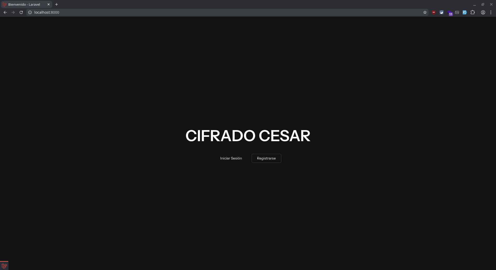

## Pantalla de Inicio de Sesión

Permite a los usuarios acceder a su cuenta.
**Campos a completar:**
- **Nombre de Usuario:** El identificador único del usuario.
- **Contraseña:** La clave de acceso.
- **Recordarme:** Checkbox para mantener la sesión iniciada.

Si no tienes cuenta, hay un enlace para registrarse. Si olvidaste tu contraseña, existe la opción de recuperación.

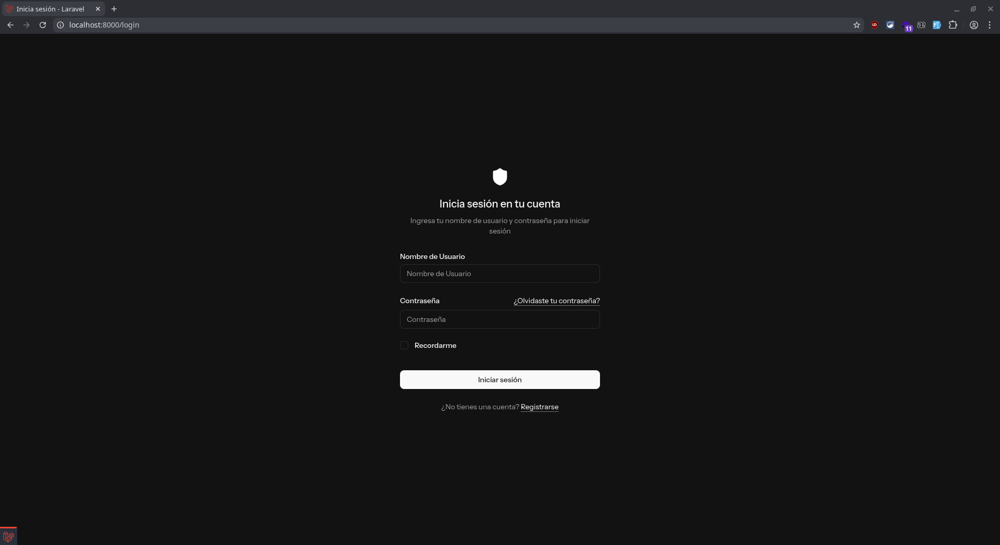

## Pantalla de Registro

Formulario para crear un nuevo usuario en la plataforma.
**Campos requeridos:**
- **Nombre y Apellido:** Datos personales.
- **Nombre de Usuario:** Identificador único para el sistema.
- **Correo electrónico:** Dirección de contacto válida.
- **Contraseña y Confirmación:** Clave de seguridad (deben coincidir).

Al completar el registro, se inicia sesión automáticamente.

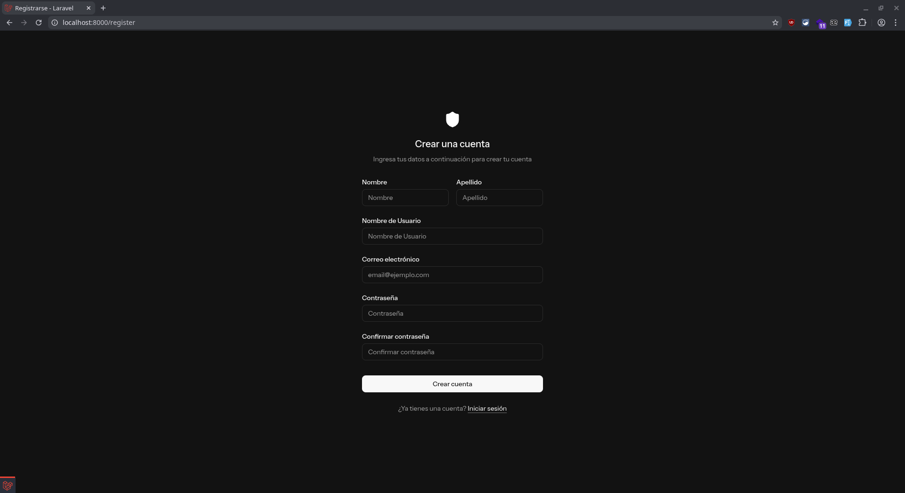

# Mensajería

## Pantalla Recibidos

Esta es la bandeja de entrada principal.
- **Diálogo de Bienvenida:** Al ingresar, verás un resumen con la cantidad de mensajes no leídos desde tu última conexión.
- **Lista de Conversaciones (Izquierda):** Muestra todas las conversaciones donde has recibido mensajes.
    - **Nombre del Usuario:** El nombre del usuario con el que tienes la conversación.
    - **Último Mensaje:** El último mensaje recibido.
    - **Fecha:** La fecha en que se envió el mensaje.
    - **Estado:** El estado del mensaje (leído o no leído).
- **Detalle de Conversación (Derecha):** Al seleccionar una conversación, verás el historial de mensajes y un formulario para responder rápidamente.
    - **Historial de Mensajes:** Muestra el historial de mensajes entre tú y el destinatario.
    - **Formulario de Respuesta:** Un formulario para responder rápidamente.

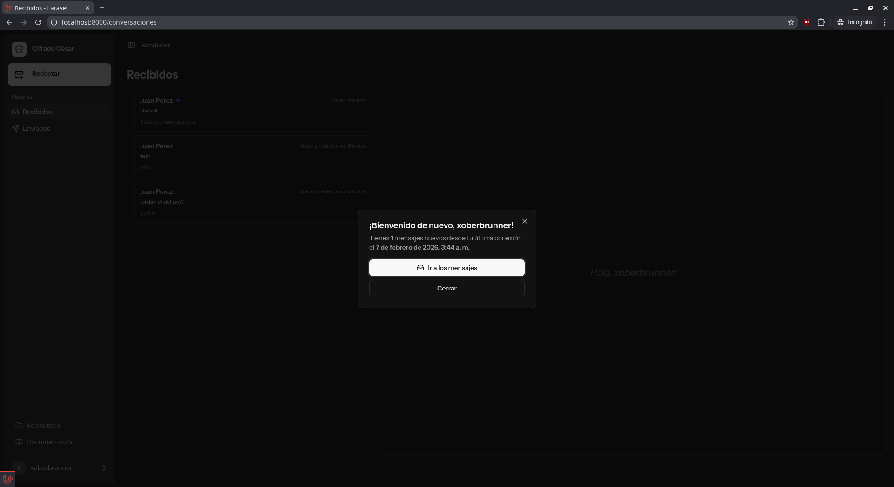
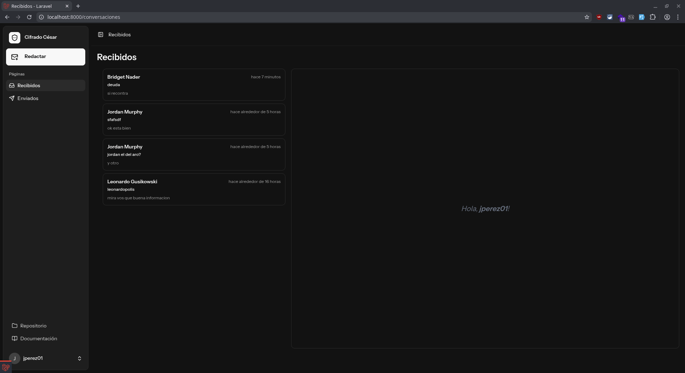

## Pantalla Enviados

Muestra el historial de las conversaciones que tú has iniciado o mensajes que has enviado. Funciona de manera similar a la bandeja de recibidos, permitiéndote revisar tus comunicaciones salientes.

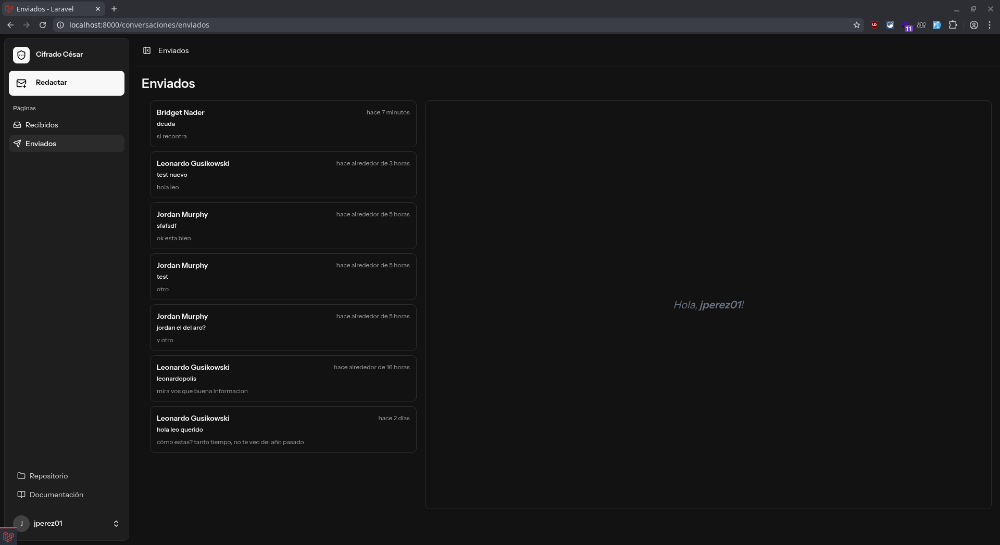

## Pantalla Redactar

Herramienta para crear y enviar nuevos mensajes cifrados.
**Campos del formulario:**
1. **Destinatario:** Selecciona el usuario al que deseas enviar el mensaje.
2. **Desplazamiento (Clave):** Elige un número entre 1 y 25. Este número es la "llave" del Cifrado César (cuántas posiciones se desplaza cada letra).
3. **Asunto:** El título del mensaje.
4. **Mensaje:** El contenido del cuerpo del mensaje.

**Vista Previa:**
A la derecha, verás una tarjeta de "Vista previa (cifrado)" que muestra en tiempo real cómo se verá el mensaje encriptado antes de enviarlo, aplicando el desplazamiento seleccionado.

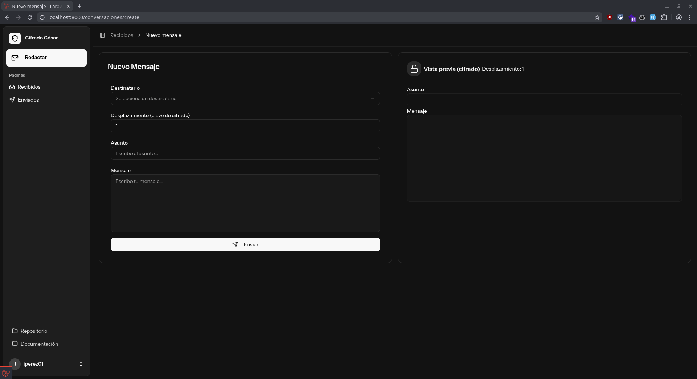
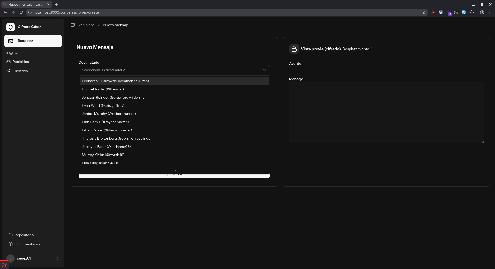
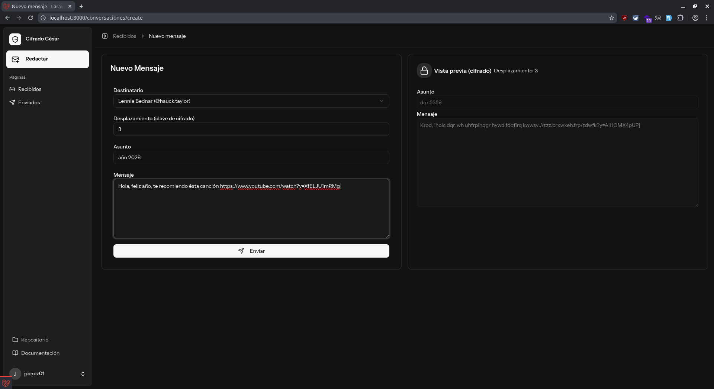

# Configuración

Ademas de poder cerrar sesión, el menú de configuración permite gestionar los detalles de tu cuenta y personalizar tu experiencia. Se divide en tres secciones principales:

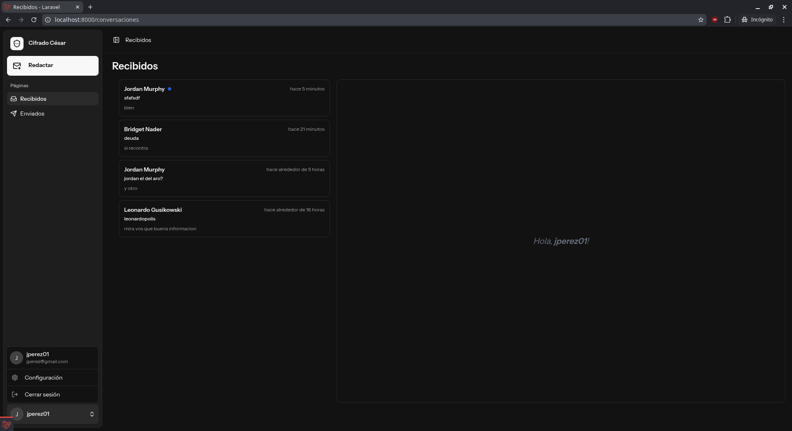

## Perfil de Usuario

En esta sección puedes actualizar tu información básica.
**Opciones disponibles:**
- **Información del Perfil:** Modificar tu nombre de usuario y dirección de correo electrónico.
- **Eliminar Cuenta:** Opción permanente para borrar tu cuenta y todos sus datos asociados.

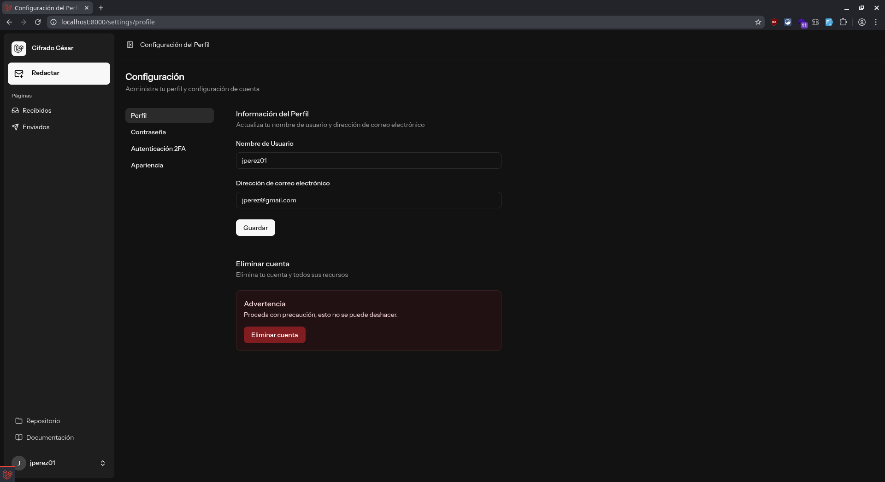

## Apariencia

Personaliza el aspecto visual de la aplicación.
- **Tema:** Elige entre modo Claro, Oscuro o Sistema (se adapta a la configuración de tu dispositivo).

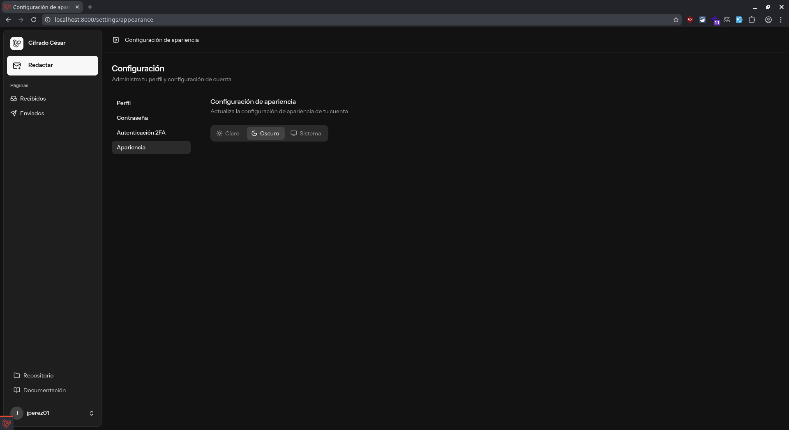