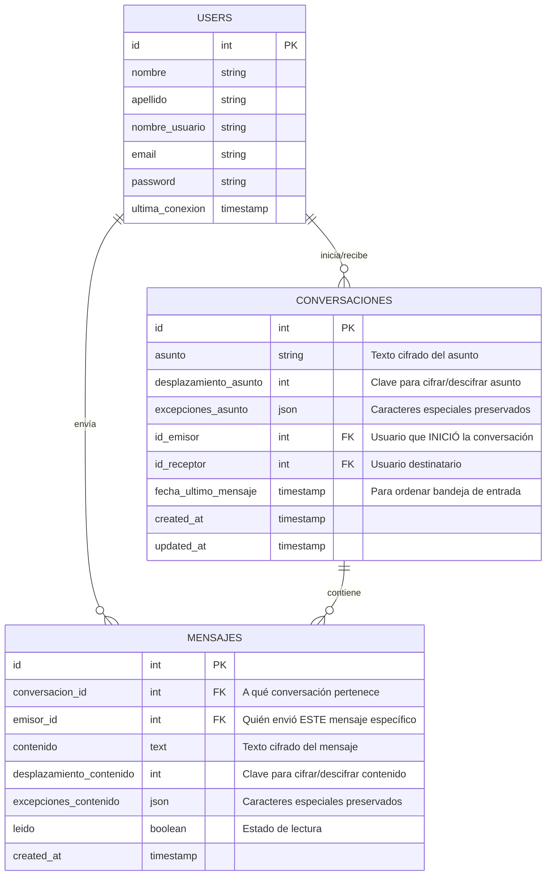

# Reestructuración: Modelo Conversaciones

Implementar tabla intermedia `conversaciones` para separar la lógica de conversación de los mensajes individuales. Esto permite:
- URLs más semánticas: `/conversaciones/{id}/mensajes`
- Mejor organización de datos (asunto pertenece a conversación, no a mensaje)
- Escalabilidad para features futuras (archivar, favoritos, etc.)

---

## Diagrama de Entidad-Relación



---

## Explicación de Campos Clave

### Conversaciones

| Campo | Tipo | Descripción |
|-------|------|-------------|
| `asunto` | string | Texto del asunto **ya cifrado** con César |
| `desplazamiento_asunto` | integer | Número de posiciones para cifrar/descifrar el asunto (1-25) |
| `excepciones_asunto` | json | Mapeo de caracteres especiales (ñ, acentos) preservados durante cifrado |
| `id_emisor` | FK → users | Usuario que **creó** la conversación (no cambia) |
| `id_receptor` | FK → users | Usuario **destinatario** de la conversación |
| `fecha_ultimo_mensaje` | timestamp | Se actualiza automáticamente al crear mensaje. Útil para ordenar conversaciones por actividad reciente |

### Mensajes

| Campo | Tipo | Descripción |
|-------|------|-------------|
| `conversacion_id` | FK → conversaciones | Agrupa mensajes de una misma conversación |
| `emisor_id` | FK → users | Quién envió **este mensaje específico** (puede ser emisor O receptor de la conversación) |
| `contenido` | text | Texto del mensaje **ya cifrado** |
| `desplazamiento_contenido` | integer | Número de posiciones para cifrar/descifrar este mensaje |
| `excepciones_contenido` | json | Mapeo de caracteres especiales preservados |
| `leido` | boolean | `false` = no leído, `true` = leído |

> [!NOTE]
> **¿Por qué `emisor_id` en Mensajes?**
> En una conversación entre Ana y Bob:
> - Ana crea conversación → `id_emisor = Ana`
> - Ana envía primer mensaje → `emisor_id = Ana`
> - Bob responde → `emisor_id = Bob`
> - Ana responde → `emisor_id = Ana`
> 
> Así cada mensaje sabe quién lo envió, sin importar quién inició la conversación.

---

## Proposed Changes

### 1. Base de Datos

#### [NEW] Migración: `create_conversaciones_table.php`

```php
Schema::create('conversaciones', function (Blueprint $table) {
    $table->id();
    $table->string('asunto');
    $table->integer('desplazamiento_asunto');
    $table->json('excepciones_asunto')->nullable();
    $table->foreignId('id_emisor')->constrained('users');
    $table->foreignId('id_receptor')->constrained('users');
    $table->timestamp('fecha_ultimo_mensaje')->nullable();
    $table->timestamps();
});
```

#### [DELETE + NEW] Migración: Recrear `mensajes` table

Campos finales:
```php
Schema::create('mensajes', function (Blueprint $table) {
    $table->id();
    $table->foreignId('conversacion_id')->constrained('conversaciones');
    $table->foreignId('emisor_id')->constrained('users');
    $table->text('contenido');
    $table->integer('desplazamiento_contenido');
    $table->json('excepciones_contenido')->nullable();
    $table->boolean('leido')->default(false);
    $table->timestamps();
});
```

---

### 2. Modelos

#### [NEW] `app/Models/Conversacion.php`

```php
<?php

namespace App\Models;

use Illuminate\Database\Eloquent\Model;
use Illuminate\Database\Eloquent\Relations\BelongsTo;
use Illuminate\Database\Eloquent\Relations\HasMany;
use Illuminate\Database\Eloquent\Relations\HasOne;

class Conversacion extends Model
{
    protected $table = 'conversaciones';

    protected $fillable = [
        'asunto',
        'desplazamiento_asunto',
        'excepciones_asunto',
        'id_emisor',
        'id_receptor',
        'fecha_ultimo_mensaje',
    ];

    protected function casts(): array
    {
        return [
            'excepciones_asunto' => 'array',
            'fecha_ultimo_mensaje' => 'datetime',
        ];
    }

    // Relaciones
    public function emisor(): BelongsTo
    {
        return $this->belongsTo(User::class, 'id_emisor');
    }

    public function receptor(): BelongsTo
    {
        return $this->belongsTo(User::class, 'id_receptor');
    }

    public function mensajes(): HasMany
    {
        return $this->hasMany(Mensaje::class, 'conversacion_id');
    }

    public function ultimoMensaje(): HasOne
    {
        return $this->hasOne(Mensaje::class, 'conversacion_id')->latestOfMany();
    }
}
```

#### [MODIFY] `app/Models/Mensaje.php`

```php
<?php

namespace App\Models;

use Illuminate\Database\Eloquent\Model;
use Illuminate\Database\Eloquent\Relations\BelongsTo;

class Mensaje extends Model
{
    protected $fillable = [
        'conversacion_id',
        'emisor_id',
        'contenido',
        'desplazamiento_contenido',
        'excepciones_contenido',
        'leido',
    ];

    protected function casts(): array
    {
        return [
            'leido' => 'boolean',
            'excepciones_contenido' => 'array',
        ];
    }

    public function conversacion(): BelongsTo
    {
        return $this->belongsTo(Conversacion::class, 'conversacion_id');
    }

    public function emisor(): BelongsTo
    {
        return $this->belongsTo(User::class, 'emisor_id');
    }

    public function marcarLeido(): bool
    {
        return $this->update(['leido' => true]);
    }
}
```

#### [MODIFY] `app/Models/User.php`

Agregar relaciones:
```php
public function conversacionesEnviadas(): HasMany
{
    return $this->hasMany(Conversacion::class, 'id_emisor');
}

public function conversacionesRecibidas(): HasMany
{
    return $this->hasMany(Conversacion::class, 'id_receptor');
}
```

---

### 3. Flujo de Usuario (UX)

```
┌─────────────────────────────────────────────────────────────────────────┐
│  LOGIN exitoso                                                          │
│       ↓                                                                 │
│  /conversaciones (index)                                                │
│  ┌─────────────────────────────────────────────────────────────────┐   │
│  │  BANDEJA DE ENTRADA             │  [Área vacía o seleccionada]  │   │
│  │  ───────────────────            │                               │   │
│  │  📧 De: Juan                    │  "Selecciona una conversación │   │
│  │     Asunto: Hola mundo          │   para ver los mensajes"      │   │
│  │     Preview: Último mensaje...  │                               │   │
│  │     hace 5 min                  │                               │   │
│  │  ───────────────────            │                               │   │
│  │  📧 De: María                   │                               │   │
│  │     Asunto: Proyecto            │                               │   │
│  │     Preview: Ok, mañana...      │                               │   │
│  │     hace 2 horas                │                               │   │
│  └─────────────────────────────────────────────────────────────────┘   │
│                                                                         │
│  Click en conversación → /conversaciones/{id} (show)                    │
│  ┌─────────────────────────────────────────────────────────────────┐   │
│  │  BANDEJA DE ENTRADA             │  CONVERSACIÓN CON JUAN        │   │
│  │  ───────────────────            │  Asunto: Hola mundo           │   │
│  │  📧 De: Juan ← (seleccionado)   │  ─────────────────────        │   │
│  │     Asunto: Hola mundo          │  [Juan] 10:30                 │   │
│  │     ...                         │  Mensaje cifrado...           │   │
│  │  ───────────────────            │                               │   │
│  │  📧 De: María                   │  [Tú] 10:35                   │   │
│  │     ...                         │  Tu respuesta...              │   │
│  │                                 │                               │   │
│  │                                 │  ┌──────────────────────────┐ │   │
│  │                                 │  │ Escribir respuesta...    │ │   │
│  │                                 │  │              [Enviar] ✉️  │ │   │
│  │                                 │  └──────────────────────────┘ │   │
│  └─────────────────────────────────────────────────────────────────┘   │
└─────────────────────────────────────────────────────────────────────────┘
```

---

### 4. Controllers (Nested)

#### [NEW] `app/Http/Controllers/ConversacionController.php`

```php
<?php

namespace App\Http\Controllers;

use App\Http\Requests\StoreConversacionRequest;
use App\Models\Conversacion;
use App\Models\Mensaje;
use App\Models\User;
use Illuminate\Support\Facades\DB;
use Inertia\Inertia;

class ConversacionController extends Controller
{
    /**
     * Lista conversaciones del usuario autenticado.
     * Muestra donde es emisor O receptor, ordenadas por fecha_ultimo_mensaje.
     */
    public function index()
    {
        $userId = auth()->id();

        $conversaciones = Conversacion::query()
            ->where('id_emisor', $userId)
            ->orWhere('id_receptor', $userId)
            ->with(['emisor', 'receptor', 'ultimoMensaje'])
            ->orderByDesc('fecha_ultimo_mensaje')
            ->get();

        return Inertia::render('conversaciones/index', [
            'conversaciones' => $conversaciones,
        ]);
    }

    /**
     * Formulario para crear nueva conversación.
     */
    public function create()
    {
        $usuarios = User::where('id', '!=', auth()->id())->get();

        return Inertia::render('conversaciones/create', [
            'usuarios' => $usuarios,
        ]);
    }

    /**
     * Crea conversación + primer mensaje en transacción.
     */
    public function store(StoreConversacionRequest $request)
    {
        $validated = $request->validated();

        $conversacion = DB::transaction(function () use ($validated) {
            // Crear conversación
            $conversacion = Conversacion::create([
                'asunto' => $validated['asunto'],
                'desplazamiento_asunto' => $validated['desplazamiento_asunto'],
                'excepciones_asunto' => $validated['excepciones_asunto'] ?? null,
                'id_emisor' => auth()->id(),
                'id_receptor' => $validated['id_receptor'],
                'fecha_ultimo_mensaje' => now(),
            ]);

            // Crear primer mensaje
            Mensaje::create([
                'conversacion_id' => $conversacion->id,
                'emisor_id' => auth()->id(),
                'contenido' => $validated['contenido'],
                'desplazamiento_contenido' => $validated['desplazamiento_contenido'],
                'excepciones_contenido' => $validated['excepciones_contenido'] ?? null,
            ]);

            return $conversacion;
        });

        return redirect()->route('conversaciones.show', $conversacion);
    }

    /**
     * Muestra conversación con todos sus mensajes (vista tipo chat).
     */
    public function show(Conversacion $conversacion)
    {
        // Verificar que el usuario pertenece a la conversación
        $this->authorize('view', $conversacion);

        $conversacion->load([
            'emisor',
            'receptor', 
            'mensajes' => fn ($q) => $q->with('emisor')->orderBy('created_at'),
        ]);

        // Marcar mensajes no leídos como leídos
        $conversacion->mensajes()
            ->where('emisor_id', '!=', auth()->id())
            ->where('leido', false)
            ->update(['leido' => true]);

        return Inertia::render('conversaciones/show', [
            'conversacion' => $conversacion,
        ]);
    }
}
```

#### [MODIFY] `app/Http/Controllers/MensajeController.php`

```php
<?php

namespace App\Http\Controllers;

use App\Http\Requests\StoreMensajeRequest;
use App\Http\Requests\UpdateMensajeRequest;
use App\Models\Conversacion;
use App\Models\Mensaje;

class MensajeController extends Controller
{
    /**
     * Crea nuevo mensaje en una conversación existente.
     * Ruta: POST /conversaciones/{conversacion}/mensajes
     */
    public function store(StoreMensajeRequest $request, Conversacion $conversacion)
    {
        $this->authorize('reply', $conversacion);

        $validated = $request->validated();

        Mensaje::create([
            'conversacion_id' => $conversacion->id,
            'emisor_id' => auth()->id(),
            'contenido' => $validated['contenido'],
            'desplazamiento_contenido' => $validated['desplazamiento_contenido'],
            'excepciones_contenido' => $validated['excepciones_contenido'] ?? null,
        ]);

        // Actualizar fecha_ultimo_mensaje
        $conversacion->update(['fecha_ultimo_mensaje' => now()]);

        return back();
    }

    /**
     * Marca mensaje como leído.
     * Ruta: PATCH /mensajes/{mensaje}
     */
    public function update(UpdateMensajeRequest $request, Mensaje $mensaje)
    {
        $mensaje->marcarLeido();
        
        return back();
    }
}
```

---

### 5. Rutas

#### [MODIFY] `routes/web.php`

```php
// ANTES
Route::resource('mensajes', MensajeController::class)->middleware('auth');
Route::get('/enviados', [MensajeController::class, 'enviados']);

// DESPUÉS
Route::middleware('auth')->group(function () {
    Route::resource('conversaciones', ConversacionController::class)
        ->only(['index', 'create', 'store', 'show']);
    
    Route::resource('conversaciones.mensajes', MensajeController::class)
        ->only(['store'])
        ->shallow();
    
    Route::patch('/mensajes/{mensaje}', [MensajeController::class, 'update'])
        ->name('mensajes.update');
});
```

**Rutas generadas:**

| Método | URI | Acción | Descripción |
|--------|-----|--------|-------------|
| GET | `/conversaciones` | index | Lista bandeja de entrada |
| GET | `/conversaciones/create` | create | Form nueva conversación |
| POST | `/conversaciones` | store | Crear conversación + mensaje |
| GET | `/conversaciones/{id}` | show | Ver chat completo |
| POST | `/conversaciones/{id}/mensajes` | store | Enviar respuesta |
| PATCH | `/mensajes/{id}` | update | Marcar como leído |

---

### 5. Form Requests

#### [NEW] `app/Http/Requests/StoreConversacionRequest.php`

```php
public function rules(): array
{
    return [
        'asunto' => 'required|string|max:255',
        'desplazamiento_asunto' => 'required|integer|min:1|max:25',
        'excepciones_asunto' => 'nullable|array',
        'id_receptor' => 'required|exists:users,id|different:id_emisor',
        // Primer mensaje
        'contenido' => 'required|string',
        'desplazamiento_contenido' => 'required|integer|min:1|max:25',
        'excepciones_contenido' => 'nullable|array',
    ];
}
```

#### [MODIFY] `app/Http/Requests/StoreMensajeRequest.php`

```php
public function rules(): array
{
    return [
        'contenido' => 'required|string',
        'desplazamiento_contenido' => 'required|integer|min:1|max:25',
        'excepciones_contenido' => 'nullable|array',
    ];
}
```

---

### 7. Policies (Autorización)

> [!NOTE]
> **¿Qué es `authorize('view', $conversacion)`?**
> Es una llamada al sistema de **Laravel Policies**. Verifica si el usuario puede realizar una acción antes de ejecutarla. Es diferente a rutas - son métodos de autorización.

#### [NEW] `app/Policies/ConversacionPolicy.php`

```php
<?php

namespace App\Policies;

use App\Models\Conversacion;
use App\Models\User;

class ConversacionPolicy
{
    /**
     * ¿Puede el usuario VER esta conversación?
     * Solo si es emisor o receptor.
     */
    public function view(User $user, Conversacion $conversacion): bool
    {
        return $user->id === $conversacion->id_emisor 
            || $user->id === $conversacion->id_receptor;
    }

    /**
     * ¿Puede el usuario RESPONDER en esta conversación?
     * Misma lógica que view.
     */
    public function reply(User $user, Conversacion $conversacion): bool
    {
        return $this->view($user, $conversacion);
    }
}
```

#### Registrar Policy en `AppServiceProvider.php`

```php
use App\Models\Conversacion;
use App\Policies\ConversacionPolicy;
use Illuminate\Support\Facades\Gate;

public function boot(): void
{
    Gate::policy(Conversacion::class, ConversacionPolicy::class);
}
```

---

### 8. Frontend

Archivos principales a actualizar:

| Archivo | Cambio |
|---------|--------|
| `resources/js/pages/mensajes/index.tsx` | Renombrar a `conversaciones/index.tsx` |
| `resources/js/pages/mensajes/create.tsx` | Adaptar para crear conversación + primer mensaje |
| `resources/js/pages/conversaciones/show.tsx` | Nueva página para ver chat |
| Componentes de cifrado | Usar `desplazamiento_contenido` y `desplazamiento_asunto` |

---

## Verification Plan

### Tests Automatizados

```bash
# Verificar auth no rota
php artisan test --compact tests/Feature/Auth

# Crear test para conversaciones
php artisan make:test --pest ConversacionTest
```

### Verificación Manual

1. **Crear conversación**
   - Login → `/conversaciones/create` → Completar form → Enviar
   - Verificar redirección a `/conversaciones/{id}`

2. **Responder mensaje**
   - Entrar a conversación → Escribir respuesta → Enviar
   - Verificar `emisor_id` correcto en BD

3. **Base de datos**
   ```bash
   php artisan tinker
   Conversacion::with('mensajes.emisor')->first()
   ```
